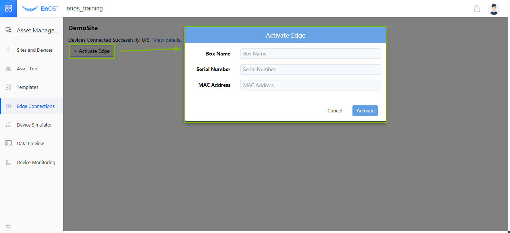
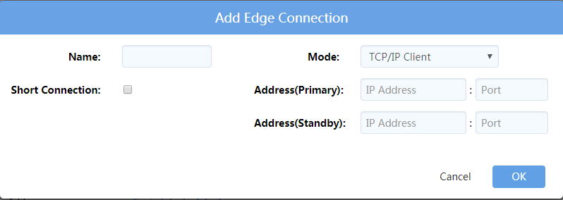
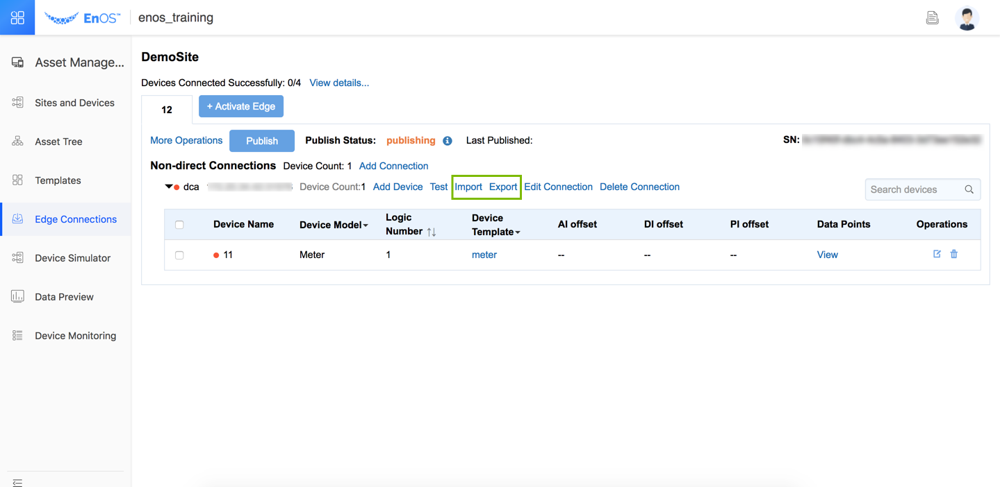
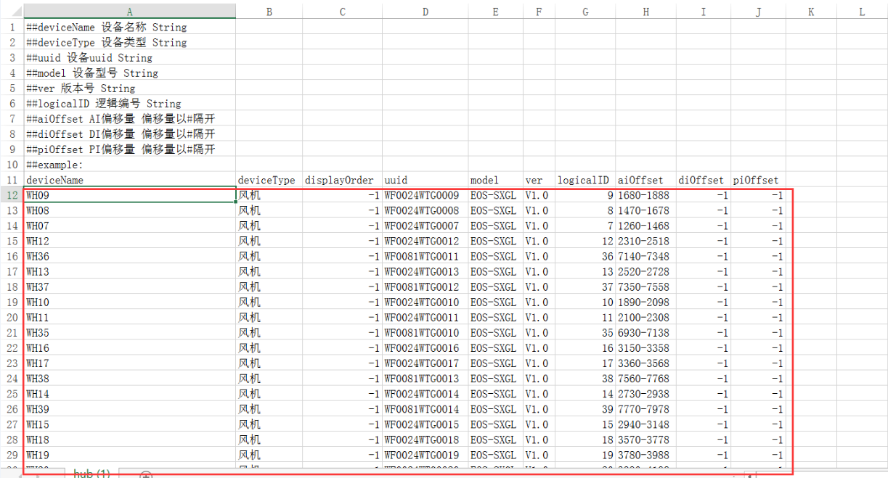

# Configuring edge connection

The device connection requires linking the device to the corresponding device template and configuring corresponding communication parameters. Check whether the connection mode is HTTP or TCP/IP. For the latter one, corresponding IP address and port number should be provided and number of linked devices should be listed.

After issuing the configuration to the edge end, if there is abnormal data, you can debug the connection to ensure that the data can be correctly sent to the cloud in a timely manner.

The procedure is shown as in the following figure:

Enter the **Edge Connection** menu to click **Configure Connection**, which is shown in the following figure:

## Before you start

An edge must have a legal serial number (SN) assigned by Envision to be recognized by EnOS™ Cloud. Obtain the SN from the Envision project manager.

## Step 1: Add edge

1. Click **Asset Management** > **Edge Connection** from the left navigation panel.
2. Click **Activate Edge** in the **Edge Connection** page and fill in edge name and serial number in the dialog edge that pops up, which is shown in the following figure:

Generally, one site only needs one edge. For large-sized site, as it contains lots of point numbers, but one edge can only be connected with limited point numbers, several edges need to be added. The system administrator should inform the user how many edges are required and how many devices can be connected to each edge based on the following data:
- The point number in the site
- The sampling frequency provided by the user.

## Step 2: Add connection

You can then click **Add connection** to add a connection in the edge. A connection is defined by its name, connection mode, and parameters based on the selected connection mode. The connection mode can be selected based on the type of the protocol and the type of the edge.

As shown in the following figure, edge is used as the TCP/IP client, so that the configured connection parameters are the IP address and port number of the server.

Generally, the edge will not be directly connected to the end server but connected through a gateway. Therefore, you need to obtain the gateway IP address and port number from the system administrator before you start mapping.

According to actual demand, several connections can be added under one edge.

**Note**: Select the type of connection according to the type of the protocol and the type of the edge.

## Step 3: Add device

After adding connection, add the device, which is shown in the following figure:

Click **Add Device** under the connection, which opens the page shown in the following figure. Select the device of same type to be added and select the device template to be linked and click Save.

  **Note**: select one type of device first and select the device template for these devices.

## Step 4: Configure the logical address and offset

As multiple devices are connected through one connection, the logical address and corresponding offset should be configured for each device. The configuration method depends on the adopted communication protocol and relevant settings. You can configure the devices one by one, or export a table of device configuration, make changes in the table, and import the configuration table to achieve batch configuration.

- Configure the device one by one

  Click the   icon after the device to edit the device.

- Batch configuration

  Click **Export** under the connection, download the connection information table and complete your configuration in the table. Then click **Import** to upload the table, which is shown in the following figure:

  

  The exported table supports the configuration of AI, DI, PI, AO, DO, PO offset. The basic configuration method is to use the short dash, for example, 0-50. When multiple offsets are needed, separate each with a semicolon. For example: 0-50;1000-1050.

  

## Step 5: Publish configuration

After completing the above configurations, publish the configuration to the edge. Click **Publish** to publish the configuration to the corresponding edge, then you will see the status right beside the **Pubish** button. After publishing, the configurations will take effect.

## Step 6: Test communication

After publishing configuration to the edge, you can inspect whether the configuration is correct or not through the communication indicator on the screen.
- When the device connects normally in the transmission layer (TCP/IP layer), the indicator is green.
- When the device connects abnormally, the indicator will turn red, which is as shown in the following figure:

There are several reasons for communication interruption:
- The configuration is not published.
- The configuration is wrong.
- The site communication is abnormal.

Therefore, you need to perform further debugging to diagnose the problem. EnOS™ provides the communication test function to help achieving the goal.

### Testing connections in batches

Click **Test** under the link and enter the batch test page of the connection, which is shown in the following figure:

Click the upper **Start/Pause** button, to start or pause the communication test function.

You can select from the drop-down list to switch the connection to debug.

Batch test provides the following tabs to help you debug the connection failor.

#### Data

View all devices under the connection or filter the devices to be viewed; view the dynamics of the data acquisition points in the edge.

Support setting numbers for the telemetering and remote communication points. Click **Set** to set the value and click **send** to send the set value to the cloud. Click one to send one and it will not terminate the uploading of original data. The operation is equivalent to inserting a value to the cloud.

#### Datagram

View the original inbound and outbound messages. And you can duplicate the messages.

#### Log

In order to avoid information overflow, informational logs are hidden and only the warning and error types of logs are displayed to help you determine the causes of communication failure.

#### Console

Provides access to the common communication debugging commands, including basic ping test, local IP inquiry, Telnet command and TCP connection inquiry command.
- The ping test requires filling in the IP address to ping.
- The Telnet command requires filling in the IP and port number to test connection to.

### Testing single device connection

Click **View** for the device to test connection for and view the data in the corresponding edge for the device. The function is consistent with what you can do in the **Data** tab in the batch test.
