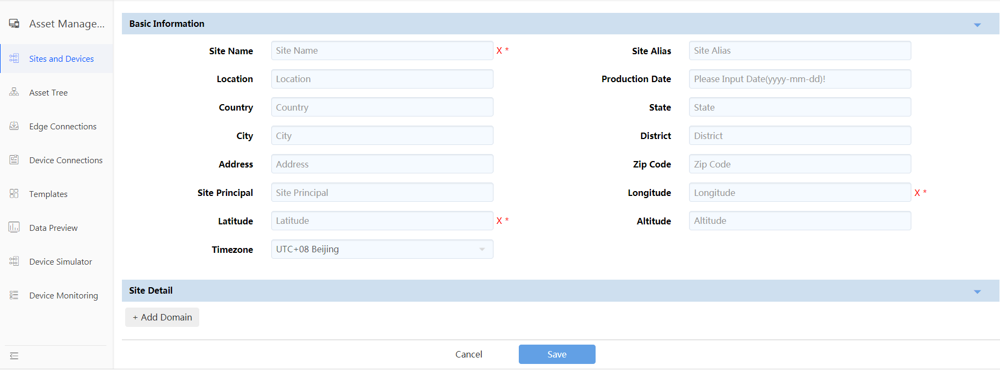
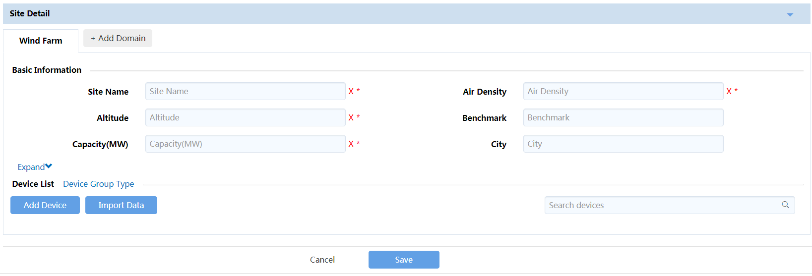
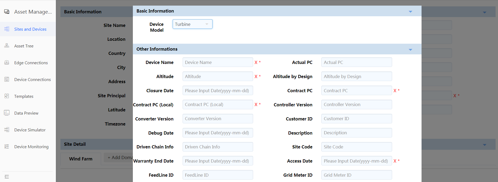
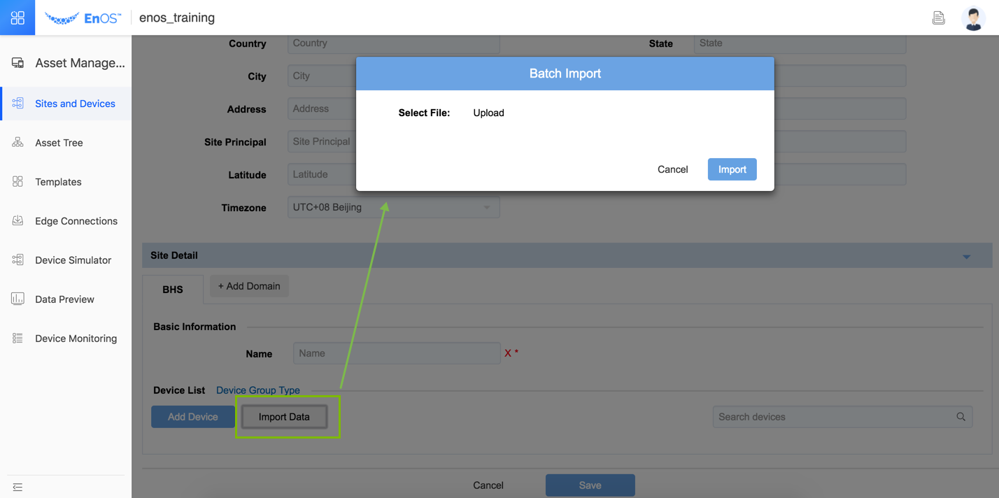

# Creating sites and devices

As shown in the figure, building new sites includes three parts:
1. Building new physical site
2. Building new logical site and adding device in the logical site.
3. Adding device, supports two modes:
   - adding one by one
   - adding in batch

## Step 1: Create a new physical site

Enter the **Asset Management > Site and Devices** menu from the left navigation bar and click **New Site** to start building the physical site as shown in the following figure.

## Step 2: Create new logical site

Build new logical site in a certain domain under the physical site.

In the configuration page of the physical site, click **Add Domain** to select the domain of the logical site and provide relevant settings as shown int he following figure.

Several new logical sites can be built under one physical site (regardless of the sites in the same domain or different domains, based on the business requirements).

## Step 3: Add devices

### Option 1: Add one by one

The devices in the site can be added under the logical site based on the device type. EnOS supports adding device one by one or in batches. Adding device one by one is applicable for the sites containing few devices or the scenarios that requires adding several device temporarily.

Click **Add Device**, select the device model type and provide relevant device settings as shown in the following figure.

### Option 2: Add devices in batches

Adding device in batches is mainly applicable for site that contains large number of devices. You can edit the device attribute information of the same device model in advance and import the device in batches at once.

**Note**: you need to add a new device manually and save the configuration successfully first so that a template can be generated before you start to add more devices in batches.

Click **Export Device Template** and select the device type in the dialog edge that pops up and download the CSV file of the corresponding type of device template.

Fill in the complete device information in the device information template table and click **Import data** to import the table to the system to achieve batch import of the same type of device data, which is shown in the following figure:

After editing, click **Save** for the batch configuration to take effect.
