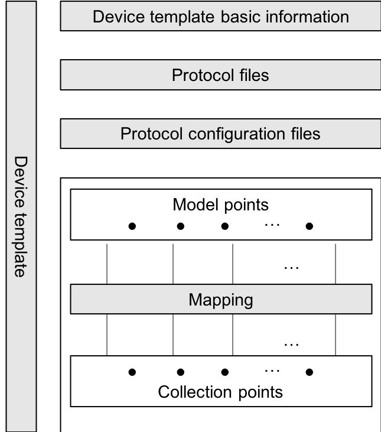
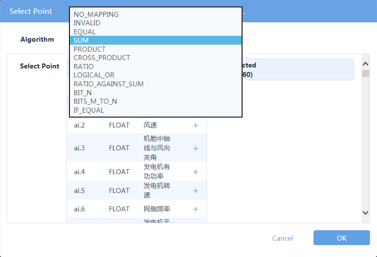

# Creating a device template

A device template is the adapter between a common device model and a specific model of device. A device template allows mapping between a specific device measuring point and a common device model.

Based on industrial experiences, EnOS™ has accumulated a number of device templates for inquiry and reuse. You can also define custom device templates.

## About this task

When you define a device template, you define the basic information, communication protocols and configuration files that defines the protocol related parameters and data points, and the mapping between the device measuring points and the standard model points. The following figure shows what's included in a device template.

### Basic information

You'll define the template name, version, device brand, product model,  and other information for re-use.

### Communication protocol and configuration files

EnOS™ supports most common standard communication protocols. For the list of communication protocols that are supported by EnOS™, see [Supported conventions by EnOS™ Edge](../protocol/deviceconnection_protocols).

You can use the built-in protocols or develop your own protocol according to your needs. For information about protocol development, see [Protocol overview](../protocol/protocol_overview).

Use the following configuration files to configure the communication
protocol:
- Use the `config.sys` file to configure the communication protocol related parameters.
- Use the `point.csv` file to configure the device collection point table.

### Mapping

You can create the device template from a device model, and set the mapping between the device measuring points and the standard measuring points of the model.

In addition to 1-to-1 mapping, EnOS™ also supports complex mapping relations configured through formulas.
When you create a device template, you must specify the mapping between
collecting points and model points. You can select a simple 1-to-1 mapping directly. When specific mapping model is involved, such as accumulation and continuous multiplication, you’ll need mapping formulas.

The following procedure shows how to specify a data collection point and
formula for a model point.

## Procedure

1. Click **Asset Management > Templates** from the left navigation panel.
2. Click **New template**.
3. In the **New template** window, provide the following settings:
   - **Name**: Enter the name of the template
   - **Brand**: Enter the brand name of the device that you want to create template for.
   - **Model**: Enter the product model of the device.
   - **Version**: Enter the version number.
   - **Domain**: Select the domain that the device belongs to.
   - **Device Type**: Select the device type.
4. Click **OK**. The template is created and shown in the template table.
5. Click the edit icon from the **Operations** column of the template.
6. In the **Configuration** section, download the
7. In the **Model Selection and Mappings** table of the device template, click the edit icon for the model point that you want to mapping data collection point for.

    

8. In the **Select Point** window, click **Add Formula**.

9. Select the data collecting point and algorithm.

    

    The following formulas are supported for non-array model points:

      <body>
  	
  	
  
  <table border="1" cellspacing="0" cellpadding="0" width="100%">
    <tr>
      <th>
Formula name
</th>
      <th>
Description
</th>
    </tr>
    <tr>
      <td>
NO_MAPPING
</td>
      <td>
NO_MAPPING: no mapping for this model point; 
</td>
    </tr>
    <tr>
      <td>
INVALID
</td>
      <td>
INVALID: No   mapping is provided for this model point (no longer used, NO_MAPPING will be   used); 
</td>
    </tr>
    <tr>
      <td>
EQUAL
</td>
      <td>
EQUAL: The   value of this model point is equal to the mapped point, i.e. y=x; 
</td>
    </tr>
    <tr>
      <td>
SUM
</td>
      <td>
SUM: all   collection points added to this mapping, i.e. $$y = \sum_{i = 1}^{n}x_{i}$$ ; 
</td>
    </tr>
    <tr>
      <td>
PRODUCT
</td>
      <td>
PRODUCT:   multiplication of all collection points added to this mapping, and multiplied   by a distributable coefficient a (i.e. &ldquo;operand&rdquo;), i.e. $$y = a\prod_{i = 1}^{n}x_{i}$$ ; 
</td>
    </tr>
    <tr>
      <td>
CROSS_PRODUCT
</td>
      <td>
CROSS_PRODUCT:   cross production of all collection points added to this mapping, and   multiplied by a distributable coefficient a (i.e. &ldquo;operand&rdquo; parameter). Note   that the sequence in which the collection points are added is very important. $$x_{1}$$   represents the first point added,  $$x_{2}$$ represents the second point added, and so   on, i.e. $$y = a(x_{1}*x_{2} + x_{3}*x_{4} + x_{5}*x_{6} + \ldots)$$ ; 
</td>
    </tr>
    <tr>
      <td>
RATIO
</td>
      <td>
RATIO: Ratio   of the two collection points added to this mapping. Note that the sequence in   which the collection points are added is very important, i.e. $$y = x_{1}/x_{2}$$ ; 
</td>
    </tr>
    <tr>
      <td>
LOGICAL_OR
</td>
      <td>
LOGICAL_OR:   Logical OR operation for the digital input DI points added to this mapping,   i.e. $$y = {(x}_{1}\left| x_{2} \right|x_{3}\left| x_{4} \right|x_{5}\left| x_{6} \right|\ldots)$$ ;
</td>
    </tr>
    <tr>
      <td>
RATIO_AGAINST_SUM
</td>
      <td>
Special formula: the following calculation is   made on the three collection points added to this mapping, i.e. $$y = x_{1}/(x_{2} + x_{3})$$ ; 
</td>
    </tr>
    <tr>
      <td>
BIT_N
</td>
      <td>
BIT_N: The specified bit of an AI point can be   taken and assigned to a new model point. It includes a parameter &ldquo;operand&rdquo;.   An operand of 0 indicates that the first bit of AI point is taken, and an   operand of 15 indicates that the 16 bit of AI point is taken.
</td>
    </tr>
    <tr>
      <td>
BITS_M_TO_N
</td>
      <td>
BITS_M_TO_N: Multiple specified consecutive bits   of an AI point can be taken and assigned to a new model point. It includes   two parameters: operand 1 (M: high bit) and operand 2 (N: low bit), M&gt;N.   E.g. if M=7 and N=0, bits 8 to 1 of the collection point are taken and   assigned to the new model point.
</td>
    </tr>
    <tr>
      <td>
IF_EQUAL
</td>
      <td>
Conditional assignment: It includes 3 operands.   Assume operand 1=a, operand 2=b, operand 3=c, then the pseudo code for this   formula is: 
        if x1 == a, then y==b, else y==c. 
</td>
    </tr>
  </table>
  

    
 

  

  </body>

  For array type model points, the following formulas are supported:

  <table border="1" cellspacing="0" cellpadding="0" width="100%">
    <tr>
      <td>
Formula name
</td>
      <td>
Description
</td>
    </tr>
    <tr>
      <td>
MULTICHANNEL 
</td>
      <td>
MULTICHANNEL: Multiple collection points are   mapped to different elements of an array type model point. Note that the   sequence in which the collection points are added is very important. represents the first point added,  represents the second point added, and so   on, i.e. y is an array: y={y[1], y[2], …, y[n]}, and y[1]=x1, y[2]=x2, …,   y[n]=x[n], n&lt;=32.  
</td>
    </tr>
    <tr>
      <td>
MULTIBIT
</td>
      <td>
MULTIBIT: Conversion of multiple DIs to AIs, i.e.   y is an int32[] type array, y={y[1], y[2], …, y[n]}, 
        and, 
        y[1].bit0=x1.bit0, 
        y[1].bit1=x2.bit0, 
        …, 
        y[1].bit31=x32.bit0, 
        y[2].bit0=x33.bit0, 
        y[2].bit1=x34.bit0, 
        …, 
        y[2].bit31=x64.bit0, 
        …, 
        y[n].bit0=.bit0, 
        y[n].bit1=.bit0, 
        …, 
        y[n].bit31=.bit0, 
        ,n&lt;=32.
</td>
    </tr>
  </table>

  **Conventions:**

  The model point is y (output), and the collection point (input) is

  

  Where i represents the sequence in which the collection points are added.
