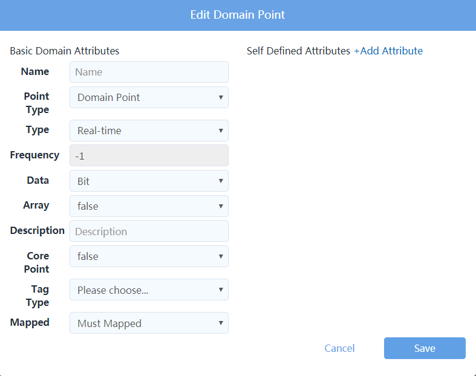
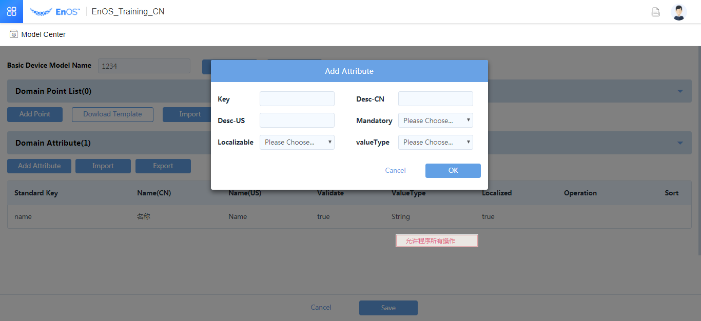

# Creating custom models

Before defining the device model, it is required to create a domain for which the site model can be established. Several basic device models can be created under the site model and device sub-model is also allowed for each basic device model. Among these, an inheritance relationship exists between the device sub-model and basic device model (Sub-model has inherited the attributes and data tags of the basic model, but can’t make revision to it;but you can add new data tags and computational logic scripts to sub-model ).

## Step 1: Create domain

Enter into **Model Center**, click the **Add Domain** button, create a new domain.

## Step 2: Create site model

Create a site model in the domain that you created in Step 1. Only one site model is permitted for a domain.

1. Create site model. Click  after the name of new domain to create a new site model.

2. Locate the site model you just created and click  after the name of the new site model. You'll add the domain points and domain attributes when you define the site model.

3. In the **Domain Point List** table, click **Add Point**. For each domain point, the settings are shown in the following figure:

    

    - **Name: Domain point name** refers to the standard data tags name defined in the model for use by application accessing data. The naming of domain points needs to follow certain specifications, as follows:
      - Only uppercase and lowercase English letters, numbers, and the underscore character _ are allowed, and must begin with an English letter;
      - The total length is less than or equal to 50 characters;
      - Within the same scope of use, do not repeat. When the judgment is repeated, it is not case-sensitive.

    - **Point type (data tag)** supports 3 types, namely the domain point, control point and pass through point;
    - **Type**: Sampling type of the data point, support 3 types, including the real-time mode, timing mode and changing mode.        
      - **Real-time** mode means that all the data tags the system received will be uploaded immediately.
      - **Timing** mode means that it is uploaded by the data point according to the predetermined sampling period at the fixed time.
      - **Changing** mode means that, it will be uploaded only when the data is changed;
    - **Frequency**: Sampling frequency of the data. it is the duration parameter of the timing mode,the unit is millisecond;
    - **Data**: Data type of point. Supports the conventional basic data types, such as Bit, Int, Float, Double, Boolean;
    - **Array:** describe whether this model point is the array type or not;
    - **Description:** name displayed to the users by this domain point.However, the domain point name is the name used by access data in the procedure;  
    - **Core point:** defaulted to be No. This default attribute will not be supported in the future;
    - **Tag type:** conventional data type in the power industry,including AI, DI, PI, AO, DO and PO;
    - **Mapped:** indicates whether this model point can be mapped or not. It supports 3 options, namely Must, Yes and No. If it is configured to be No, it will not be displayed in the device template module for preventing this model point from being mapped accidentally.

4. In the **Domain Attribute** table, click **Add Attribute**.

   The settings are shown as in the following figure:

   

   - **Key: Key value**, it is the key value of attributes for use by the application accessing data;
   - **Desc-CN: Chinese description**, it is the Chinese name of the attributes for the reference by users;
   - **Desc-US: English description**, it is the English name of the attributes for the reference by users;
   - **Mandatory**: it is used to indicate whether this attribute is required or not. If yes, this attribute must be filled when the model instance is being created, or else, this model instance will not be created;
   - **Localizable**:it is used to indicate whether the contents of this attribute is available in both Chinese and English or not;
   - **Value Type:** it is used to indicate the data type of this attribute content. Data type supported will include String, Integer, Number, Date,Time, Enum, Email;

   The sequence of attributes is the sequence to be filled when instantiating the device model. You can move the important attributes (such as the required attributes) to the top for filling during the implementation.

5. In the **Script File** section, click **Add Script File** to create calculation scripts.

  

  Script syntax is subject to the Groovy syntax (<http://www.groovy-lang.org>). However, for the sake of safety, some advanced Groovy functions are disabled in the script (such as defining a new type).

  In order to use the Groovy script to complete the real-time processing of device data, EnOS™ has provided some methods to be used in the script. The users may employ these methods to finish the data reading and configuration at the domain point and reading of device attributes.

  The most commonly used methods are listed in the following:

  - Read the value of a domain point

    ```groovy
    Number input(String domain-point-name)
    ```

    Regard the domain point name as the parameter. Such domain point name must match with definition in the device model. Return value is of int or float type. Please refer to the definition of domain point in the device model.

  - Set the value for any domain point (namely, generating a piece of data for a domain point)

    ```groovy
    void output(String domain-point-name,Number value)
    ```
      Domain point name must match with definition in the device model. The value to be configured is of int or float type. During the setting process, EnOS™ will convert the value into the value type for matching with domain point definition.

  - Judge whether the attributes of an device field exist or not
      ```groovy
      Boolean attrExists (String attribute-name)
      ```
      Regard the Key value of domain attributes as the parameter. Such Key value must be defined in the device model.

  - Read the attribute value of an device field as the character string
    ```groovy
    String attrString (String attribute-name)
    ```
    Regard the Key value of domain attributes as the parameter. Such Key value must be defined in the device model.

The aforesaid methods are the most commonly used and predetermined method in the model script. EnOS™ has also provided some methods for the calculation of the multipath domain points.For more details, please contact the EnOS™ technical personnel.

The following two examplesare used to demonstrate the script use:
```groovy
if(input("INV.FaultCode")==28

||input("INV.FaultCode")==38)

{

   output("INV.Fault", 1)

}

else

{

   output("INV.Fault", 0)

}
```
In the aforesaid script,when INV.FaultCode domain point is received every time and value is 28 or 38,EnOS™ will generate a piece of data for INV.FaultCode domain point and its value is 1; when INV.FaultCode domain point is received every time, but the value is not 28 or 38, EnOS™ will generate a piece of data for INV.FaultCode domain point and its value is 0.
```groovy
if(attrExists("invType")&&attrString("invType") =="STRING") {

   output("INV.Disperse", mcCoV("INV.BranchCurIn") *100.0)

}
```
In the aforesaid script,for the device of which the domain attribute invType is set as STRING, after the multipath domain point INV.BranchCurIn data is received every time, EnOS will calculate its dispersion ratio and multiply by 100 before configuring to another domain point INV.Disperse. Calculation will not be performed for the device of which the domain attribute does not meet the conditions.

## Step 3: Create basic device model

It is allowed to create device models under the newly built site model. Several device models may be added under the site model.

1. Create basic device model. Click  button after the newly site to create a new device model.

2. Locate the device model you just created and click  after the name of the new device model.

  Editing the basic device model is similar to the editing operation of the site model.

## Step 4: Create device sub-model

It is possible to create the device sub-model under the newly built basic device model. This sub-model will inherit the basic model. Data tags and attributes inherited can’t be edited. New data tags and calculation scripts can be added.
