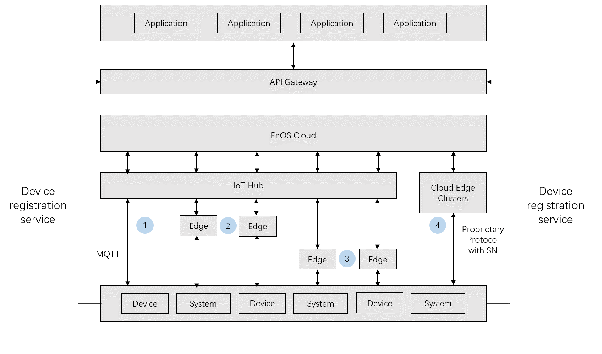

# Device Provisioning Overview

The EnOS™ Device Provisioning service helps IoT engineers to manage the device lifecycle, establish connection from the devices to the EnOS Cloud, and secure the two-way communication between the devices and the cloud.

## Concepts

**Model**

A model is the abstraction of the features of an object that is connected to IoT. The model defines the features of the object's attributes, measure points, services, and events. For more information, see [Model Overview](model_overview). A model can be associated with multiple _products_.

**Product**

A product, or product model, is a collection of devices with the same features. On the basis of the model, a product further defines the communication specifications for the device to connect to the internet of things. A product can contain multiple _devices_.

**Device**

A device is the instance of a product.

## Major Functions

The EnOS Provisioning service provides the following key features:

### Device Connection

Provides device SDK to allow devices to connect to the IoT Hub.
- Provides MQTT device SDK to meet the real-time requirements for long connections and low power requirements for short connections.
- Provides connection schemes such as direct device connection and indirect connection through gateway proxies, providing solutions to meet the requirements of various scenarios for the heterogeneous network devices of enterprises.

### Device Management

Supports complete device lifecycle management, including:
- Device registration
- Device configuration
- Remote control
- Firmware upgrade
- Real-time monitoring
- Device logout

### Model Management

Provides device models. The device model allows devices of thousands of models from different manufacturers to be unified into a small number of common models and thus simplifies application development.

### Device and Cloud Security

**Authentication**

- Supports _secret-per-device_ authentication mechanism, reducing the security risk that the device may be hacked. This machanism is suitable for devices that can be burned with pre-allocated device key into each chip in batches.

- Supports _secret-per-product_ mechanism, where devices are pre-burned with product credentials. The device can dynamically acquire the device secret during authentication. This machanism is suitable for situations where _device triple_ cannot be burned into each device in mass production.

For more information, see [Device Authentication Mechanism](deviceconnection_authentication).

**Communication and Data Security**

- Encrypts and decrypts data through the CA certificate mechanism to ensure the security of communication between the device and the cloud.

- Segregates communication resources by topic to prevent devices from accessing unauthorized data.

## Architecture

As shown in the figure below, a device can be connected directly or through the edge to the EnOS IoT Hub. The EnOS IoT Hub accepts direct-connecting devices or edges to communicate via the MQTT protocol. MQTT is a lightweight open-source IoT protocol based on TCP/IP. EnOS's MQTT protocol supports the following features:

- Topic-based subscriptions and publish of data

- RRPC

Based on whether and where the edge device is used in the connection. The following connection scenarios are supported:

**Scenario 1: Connect through EnOS IoT Hub via MQTT protocol (cloud service)**

This method requires the devices to support MQTT protocol and is applicable to most of the new IoT devices.

**Scenario 2: Connect through on-site EnOS Edge**

In this case, the EnOS Edge is deployed on-site with the devices. This method mainly applies to traditional devices and systems that do not support the MQTT protocol.

**Scenario 3: Connect through remote EnOS Edge**

In this case, the EnOS Edge is deployed remotely at the cloud side. This method mainly applies to traditional devices and systems that do not support the MQTT protocol.

**Scenario 4: Connect through EnOS™ Cloud Edge clusters (cloud service)**

This requires that the device to be connected has a unique ID and can upload data through supported communication protocols. This method is frequently used for the photovoltaic device connection.

Data is sent to the EnOS Cloud via the IoT Hub and distributed by the rule engine to different storage or functional modules for further processing:

- Time series database
- Alert engine
- Stream computing engine

## Functional Modules

### IoT Hub

IoT Hub is a cloud broker service that EnOS provides for device connection.

The cloud broker provides the following functions:

- Safe and reliable large-scale bi-directional message transmission from the devices to the cloud.

- Forwarding the data from the client to corresponding subscribers on EnOS™.

- Providing license authorization and creation of thing and policy themes.

- Exposing interface for connections from MQTT clients.

### EnOS Edge

Edge is the front end of Envision EnOS IoT platform for data acquisition. It is used to collect on-site device data or connected to a third party system for data acquisition and transmission of data to the EnOS Cloud.

Edge, as software, supports data acquisition, multiple communication conventions, local caching and breakpoint continuation. It can either be deployed in a cloud machine or an on-site hardware of a specified brand model. An edge must have a legal serial number (SN) assigned by Envision to be recognized by EnOS Cloud. For more information, see [EnOS Edge Overview](https://docs.envisioniot.com/docs/enos-edge/en/latest/edge_overview.html)
