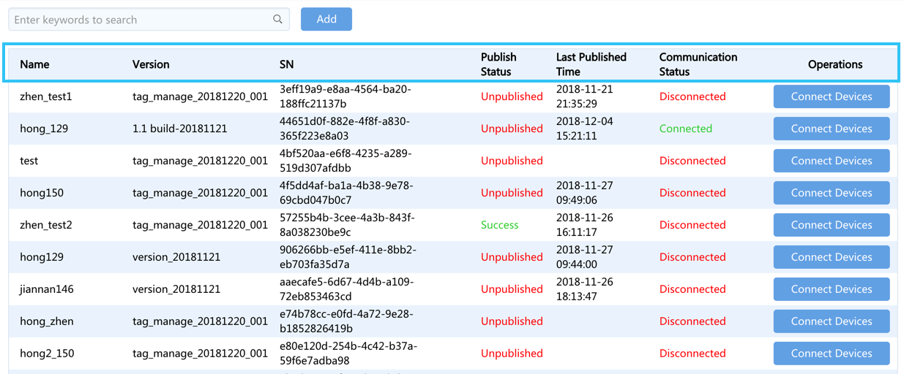
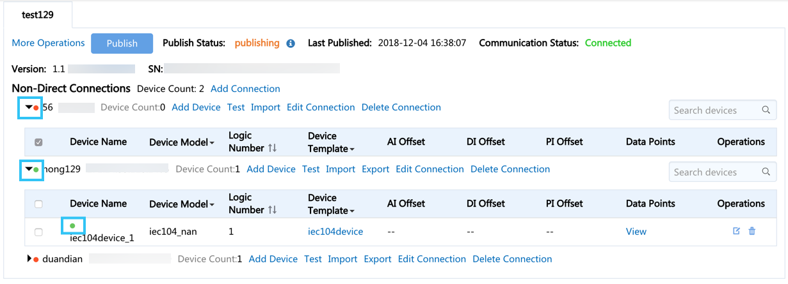
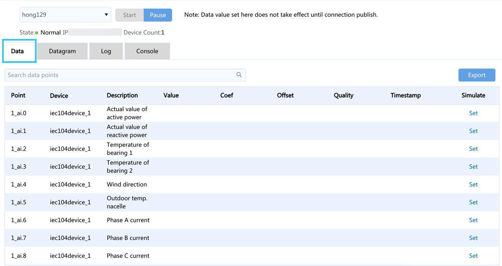
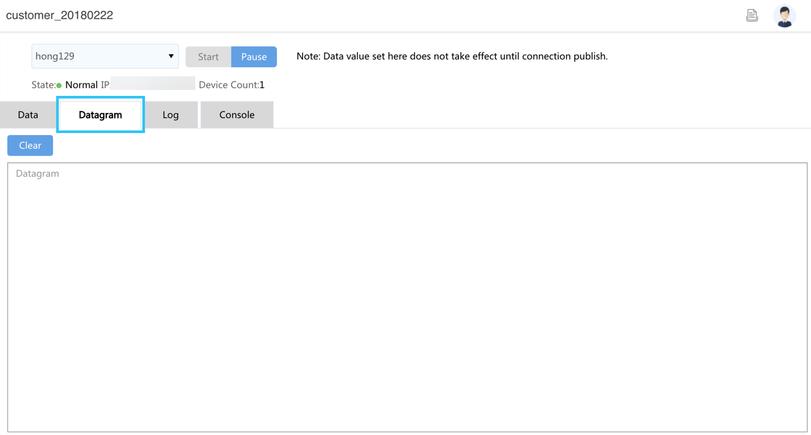
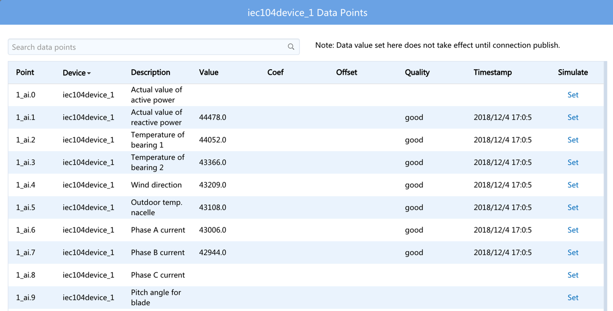

# Add EnOS Edge Gateway

The Edge gateway needs to be configured when using it to connect the sub device. This article describes how to configure it to complete the connection configuration between it and the sub device.

## Before You Start

1. You must have obtained the serial number (SN) of the Edge gateway.
2. You must have completed the initialization of the Edge gateway. The hardware initialization of the Edge gateway is usually done by the Envision project team. For more information, please consult project manager of Envision.

## Step 1: Add and Activate the Edge Gateway

1. Select **Device Edge Connection > Edge Management** in the EnOS console.
2. Click **Add** button at the top left of the page to enter the name and serial number of the Edge gateway.
3. Click **Save** to complete the addition of the Edge gateway.

After the Edge gateway is successfully added, you can view the name, SN, version, and current communication status and publish status of each Edge on the **Edge Management** page, as shown in the following figure:

## Step 2: Connect the Sub-device

After the Edge gateway is added, you can use it to complete data connection of the sub-device. Click **Sub-device Connection** button after the Edge gateway record in the table to open the Edge gateway sub-device connection configuration page.

### Add Connection

The first step in connecting a sub-device is to configure a communication connection for the Edge gateway. According to actual needs, multiple connections can be added under one Edge, and the connection method shall be selected according to the protocol type. Follow the following steps to add a connection:

1. Click **Add Connection** button on the page.
2. Fill in the name of the connection in the pop-up dialog box, select the connection method, and set the connection parameters according to the selected connection method.

As shown in the following figure, Edge is used as the TCP/IP client, so the configured connection parameters are the server's IP address and port number.

*Note: Usually the Edge will not connect directly to the peer server or device, but will connect to a network gateway, and then connect to the peer server or device via this gateway. Therefore, you need to pay attention to the mapping configuration of the IP address and port number of the gateway to the edge. *

*Figure: Example of Adding Connection*

### New Device

After adding connection, the next step is to add devices to the connection. As shown below:

*Figure: Add Devices to the Connection*

**New Device**

1. Click **New Device** button under the connection.
2. Select the product to which you want to add the devices, select the devices you want to add, and select the device template that the device needs to be associated with, then click **Save**. As shown below:

  *Note: You need to select the same kind of devices first, then you can select the device template for these devices. The device template is equivalent to the device communication driver, which includes the device communication point table, communication protocol, protocol configuration file and other information. For more information, please refer to [Managing Templates](managing_templates)*

  

  *Figure: New Device*

**Update Basic Information**

If the basic information of the added device needs to be updated, click **Export** button under the connection to export the device connection information table. After filling in the table, click **Import** to upload this information table. As shown below:

*Figure: Update Device Information*

*Figure: Device Connection Information Table*

<!--Click the **Delete** button next to the device to remove this device from the connection. To delete devices in batch, check the devices you want to delete under this connection, and click the “Bulk Delete” button.-->

### Configure Logical Addresses or Offsets

Since multiple devices are connected under one connection, each device needs to be configured with its logical address and offset of various points. The method of configuration depends on the communication protocol used and its settings. You can configure the device one by one, or export the device connection information table and then import it into the system after offline configuration to implement batch configuration.

- Configure device by device

   Edit this device by clicking **Edit** icon next to the device

   

   *Figure: Configure Logical Addresses and Offsets on a Device-by-Device Basis*

- Batch configuration

   Click the "Export" button under the connection, download and fill in the connection information table, and then click the "Import" button to upload it, as shown below:

   

   *Figure: Device Connection Information Table*

   The configuration that supports the AI, DI, PI, AO, DO, and PO offsets in the exported table. The basic configuration method uses dash-connection, such as `0-50`, when there are multiple offsets at the same time, you can use `\#` to separate multiple values , such as `0-50\#1000-1050`

### Publish Configuration

After completing the above various configurations, you need to publish the configuration to the Edge. Click "Publish" to publish the configuration to the corresponding Edge and view the publish status. The configuration will not take effect until it is published. As shown below:

*Figure: Publish Configuration to Edge*

## Step 3: Test Communication

After completing and publishing the configuration to the Edge, you need to check whether the configuration is correct. On the connection configuration page, a communication indicator is provided. When the device connection is normal in the transmission layer (TCP/IP layer), the indicator is green, otherwise it is red. As shown below:

*Figure: Communication Status Indication Icon on Transport Layer*

There are several reasons for communication interruption, including but not limited to the following reasons:
- Configuration is not delivered
- Configuration error
- There is an abnormal communication at the station end
Therefore, further debugging is needed to help the user locate the problem. EnOS Edge provides communication testing capabilities to help achieve this goal.

Click **Test** button under the connection to open the batch test page for the connection as shown below:

*Figure: Bulk Communication Test Overview*

- You can switch connections by using the drop-down menu.
- You can activate or pause the communication test feature by clicking the **Start/Pause** button.

Batch testing provides four features: data, original message, log, and console. You can switch between different features by clicking the corresponding tabs. The following contents describe the usage and meaning of each tab:

### Data

On the data tab, you can view all the devices under this connection, or filter the devices you want to view to see the update of the collection point data in the Edge.

*Figure: Data Feature*

This test feature supports telemetry and remote signal point number setting. Click **Add Set Number** to set the value, click **Send** to send the set value to the cloud. Click once to send one time, it will not terminate the upload of the original data, equivalent to inserting a value to the cloud.

*Figure: Number Setting Feature*

### Original Message

On the original message tab, you can view and copy the original message received and sent.

*Figure: Original Message Feature*

### Log

To avoid flooding of information, the tab hides the log of info types and only displays logs of warning and error types to assist the user in determining the cause of the communication error.

*Figure: Log Feature*

### Console

On this tab, you can use common communication debugging commands, including the ones for basic ping tests, native IP viewing and Telnet, as well as for TCP connection viewing.
- The ping test needs to fill in the IP address of the required ping in the input box.
- Telnet test requires IP and port number

*Figure: Console Feature*

### Communication Test for a Single Device

Under each connection on the device list page , click **View Data** button of the single device to perform a communication test on a single device and view the data in the Edge corresponding to the device. This feature is consistent with the data features in the bulk test, except that only a single device is tested here.

*Figure: Single Device Communication Test Feature*

## Summary

After the connection configuration of the sub-devices is completed in the Edge gateway, the data of these sub-devices is automatically sent to the EnOS cloud.
