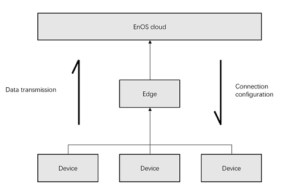
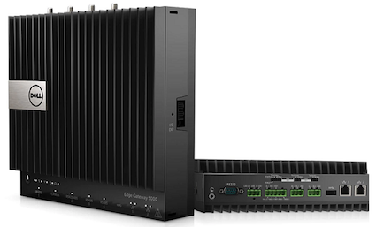

# EnOS™ Edge connection overview

An edge extends the connectivity of EnOS™ to support more communication protocols and data formats. The edge can be hardware-based deployed on-site or software-based deployed in the cloud.

In the device connection data link, the devices sends data to edge, and the edge aggregates the data and uploads into the EnOS cloud. The data transmission is a bottom-up process. While the device connection configuration is a top-down process, where you configure the connection between the cloud and edge first, then the connection between the edge and the devices.

Because the devices connected through EnOS™ can be of different product models with different names for the data collecting points, you'll need to specify the mapping between the data collecting points and the standard model points through a device `template`.

## Key concepts

**Template**

Device templates, which play as the adaptor between device models and real devices, mainly define the communication protocol and mapping relationship between the data acquisition point and device model point.

### Connection mode

The EnOS™ Edge can connect to the EnOS™ cloud in the following mode:

#### TCP/IP client
Edge connects the cloud as a TCP/IP client.

#### TCP/IP server
Edge connects to the cloud as a TCP/IP server

#### HTTP(s) client
Edge connets to the cloud as an HTTP(s) client.

#### HTTP(s) server
Edge connects to the cloud as an HTTP(s) server.

### Short or long connection

The connection between the EnOS™ Edge and the EnOS™ cloud can be a short connection or long connection.

#### Short connection

1. The client initiates the connection request. The bi-directional connection is established when the server receives the request.
2. The client sends messages to the server and gets responses from the server. A session is completed.
3. Either party can initiate the termination request to close the connection. Usually, it is the client to initiate the termination request.

#### Long Connection

1. The client initiates the connection request. The bi-directional connection is established when the server receives the request.
2. The client sends messages to the server and gets responses from the server. A session is completed.
3. The connection is not terminated after a session is completed. Future transmissions reuse the same connection.

## Applicable scenarios of EnOS™ Edge connection

In energy, power, building, and energy storage industries, most devices are not
compatible with MQTT protocols. In these scenarios, Edge with multiple
convention analysis abilities is often used.

Moreover, instead of communicating directly with EnOS™ platform, some devices are connected to a third party system (such as SCADA system), and the data are relayed via the third party system to the EnOS™ platform. Traditional SCADA systems typically don’t support relay via MQTT protocols. In these scenarios, Edge will also be selected.

## Examples edge devices

