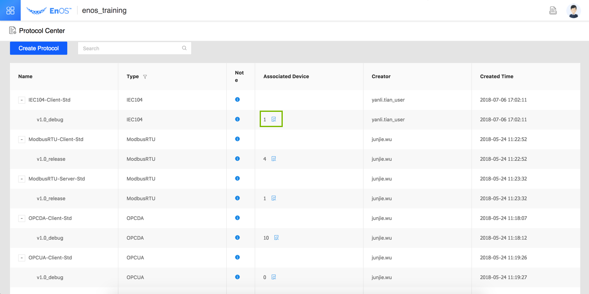

# Managing protocols

## Checking the associated templates of protocol

Click into **Protocol center \> Protocol configuration** menu, under the column of "Associated Template", you can check the number of device templates currently associated with each protocol, name of corresponding device templates, customers, and power stations used.

## Deletion of protocol

It is usually not recommended to delete protocols. Only protocols that are not associated with any device template can be deleted. If the protocol has been associated with a device template, it means the protocol may have been used, so deletion is not allowed and the “Delete” link is nonexistent.

## Update of protocol

On a protocol group, you can upgrade the group of protocols by adding a new version of protocol under the protocol group.

*Note: Protocols under the same group must be compatible backwards; otherwise, select New Protocol to create a new protocol group.*

Click **Update**, fill in the specification of new version in the pop-up dialog box **Upload**, and upload the jar package of the protocol program。

*Note: Reason for upgrading: In this drop-down menu, you can select "New Function" or "Repair Vulnerability". If you select “New Function”, the function version number will be increased by 1, while if you select "Repair Vulnerability", the revision version number will be increased by 1. If this upgrade includes both new functions and repair vulnerabilities,select "New Function" only. The newly added protocol is marked as debug by default.*
